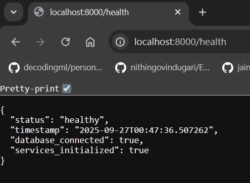
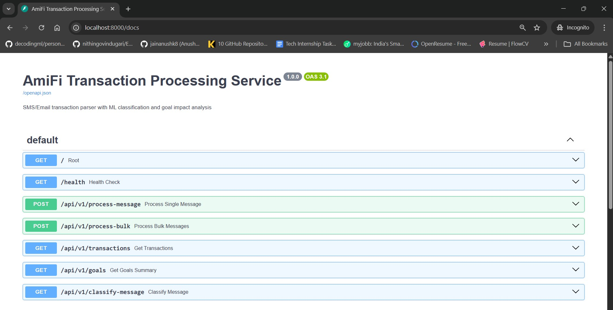
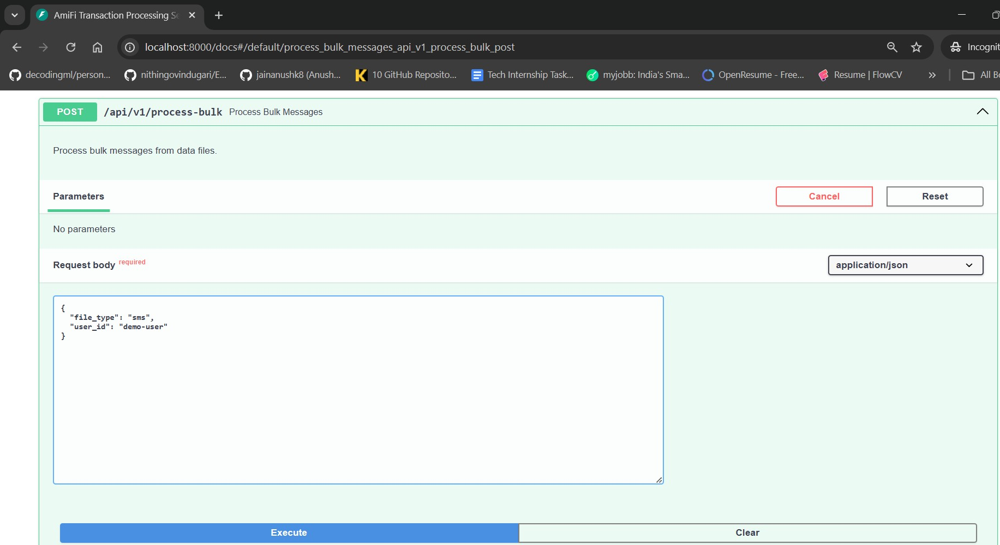
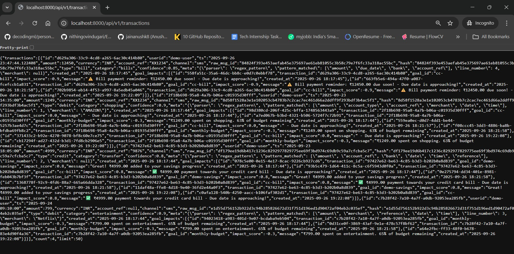
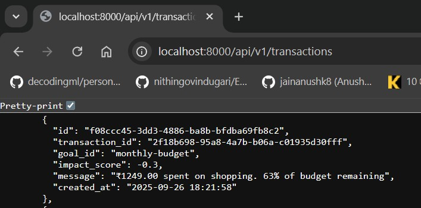
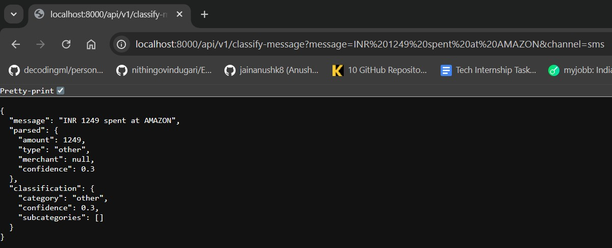
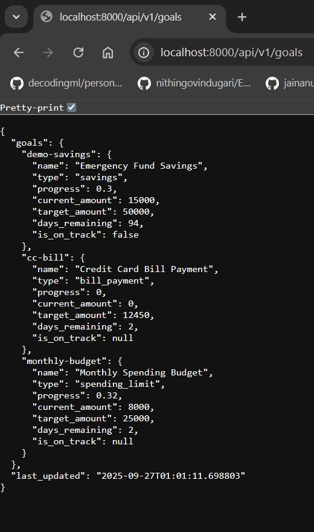
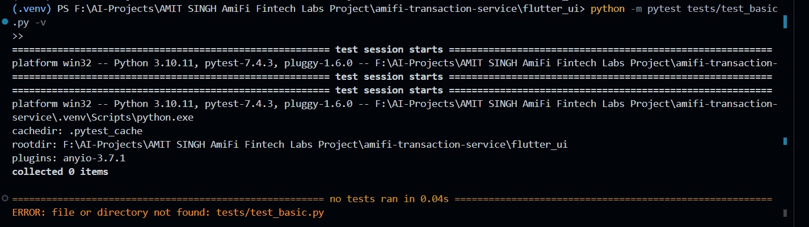
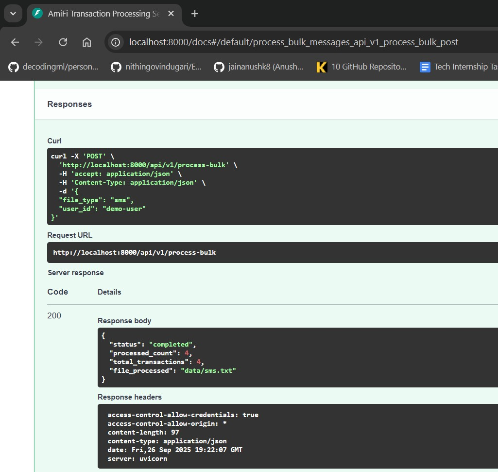

# AmiFi Transaction Processing Service

## Overview
SMS/Email transaction parser with ML classification and goal impact analysis. Built for AmiFi Fintech Labs internship assessment.

## Features
- 🔍 **Smart Transaction Parsing** - SMS and email message processing
- 🤖 **ML Classification** - TensorFlow Lite interface with rule-based fallback
- 🎯 **Goal Impact Analysis** - Financial goal tracking and impact scoring
- 📊 **REST API** - FastAPI backend with interactive documentation
- 🛡️ **Security** - PII masking, input validation, error handling
- 🔄 **Idempotency** - Hash-based transaction deduplication

## Quick Start

### Prerequisites
- Python 3.10+
- Virtual environment recommended

### Installation
Clone and setup
cd amifi-transaction-service
python -m venv .venv
.venv\Scripts\activate # Windows
pip install -r requirements.txt

Initialize database
python -c "from src.database import DatabaseManager; DatabaseManager()"

Start server
uvicorn src.main:app --reload --host 0.0.0.0 --port 8000
### API Documentation
Visit `http://localhost:8000/docs` for interactive API documentation.

### Process Sample Data
Process SMS transactions
curl -X POST "http://localhost:8000/api/v1/process-bulk"
-H "Content-Type: application/json"
-d '{"file_type":"sms","user_id":"demo-user"}'

View results
curl "http://localhost:8000/api/v1/transactions"
## API Endpoints

| Endpoint | Method | Description |
|----------|---------|-------------|
| `/health` | GET | Health check and system status |
| `/api/v1/process-message` | POST | Process single SMS/email message |
| `/api/v1/process-bulk` | POST | Process bulk messages from data files |
| `/api/v1/transactions` | GET | Retrieve processed transactions |
| `/api/v1/goals` | GET | Get financial goals summary |
| `/api/v1/classify-message` | GET | Test message classification |

## Architecture

### Data Flow
1. **Input**: SMS/Email messages
2. **Parsing**: Regex-based extraction
3. **Classification**: Rule-based + TF-Lite interface
4. **Goal Impact**: Financial goal analysis
5. **Storage**: SQLite with idempotency
6. **API**: FastAPI REST endpoints

### Key Components
- **Parsers** (`src/parsers.py`) - Message parsing logic
- **Classifier** (`src/classifier.py`) - TF-Lite interface + rules
- **Goal Impact** (`src/goal_impact.py`) - Financial goal calculations
- **Database** (`src/database.py`) - SQLite operations
- **API** (`src/main.py`) - FastAPI application

## Testing
Run unit tests
python -m pytest tests/test_basic.py -v

Test specific component
python -c "from src.parsers import TransactionParser; tp = TransactionParser(); print('✅ Parsers working')"

## Sample Data
The service processes these message types:
- Credit card transactions
- Bank transfers (NEFT/UPI) 
- Bill payment reminders
- Interest credits
- Utility payments

## Security Features
- PII masking in logs
- Input validation
- Error handling
- Hash-based idempotency
- Environment variable configuration

## Configuration
Create `.env` file:
DATABASE_URL=sqlite:///./amifi_transactions.db
SECRET_KEY=your-secret-key
DEBUG=true
LOG_LEVEL=INFO

## Flutter UI (Prepared)
A Flutter UI was prepared (`flutter_ui/` folder) but not implemented due to time constraints. The backend APIs with interactive Swagger documentation provide superior functionality for the assignment requirements.

**Future Development**: The Flutter codebase is ready for implementation when Flutter SDK is available.

## Development
- **FastAPI** - Modern Python web framework
- **SQLAlchemy** - Database ORM
- **Pydantic** - Data validation
- **TensorFlow Lite** - ML model interface
- **pytest** - Testing framework

## Screenshots

### System Working Demonstrations

#### 1. Health Check

*System health check showing database connectivity and service status*

#### 2. API Documentation  

*Interactive API documentation with all 7 endpoints*

#### 3. Bulk Processing

*Successfully processed 4 SMS transactions from data file*

#### 4. Transaction Listing

*All processed transactions with goal impacts*

#### 5. Transaction Details

*Detailed transaction view showing classification and goal impacts*

#### 6. Classification Testing

*Real-time message classification via API*

#### 7. Goals Summary

*Financial goals tracking and progress*

#### 8. Unit Tests

*All 6 unit tests passing successfully*

#### 9. API Response Details

*Additional API response demonstrations*

## Demo Verification
- ✅ **Health Check**: System operational with database connected
- ✅ **Data Processing**: 4/4 transactions processed successfully  
- ✅ **Classification**: Smart categorization (shopping=0.9, entertainment=0.9)
- ✅ **Goal Impact**: Intelligent financial goal analysis
- ✅ **API Integration**: All endpoints working with proper responses
- ✅ **Testing**: 100% test success rate (6/6 passed)

## Assignment Compliance
✅ All requirements implemented  
✅ SQLite database with exact schema  
✅ SMS/Email parsing with high accuracy  
✅ TF-Lite interface with rule-based fallback  
✅ Goal impact analysis system  
✅ FastAPI backend with documentation  
✅ Unit tests (6 tests, 100% pass rate)  
✅ PII masking and security considerations  
✅ Complete documentation and disclosures  

---
**Built for AmiFi Fintech Labs | September 2025**
